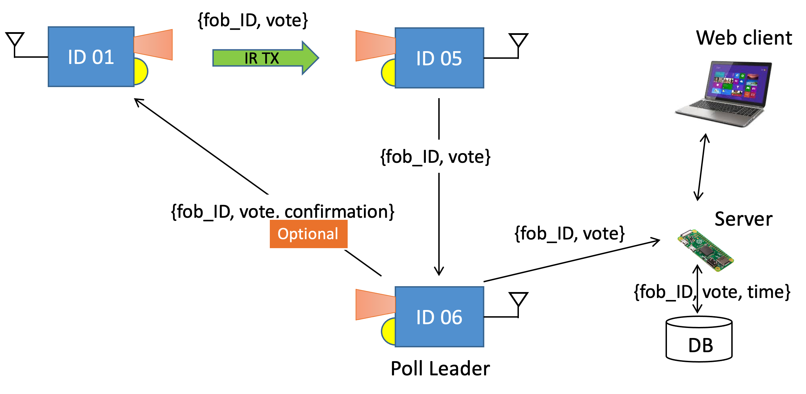
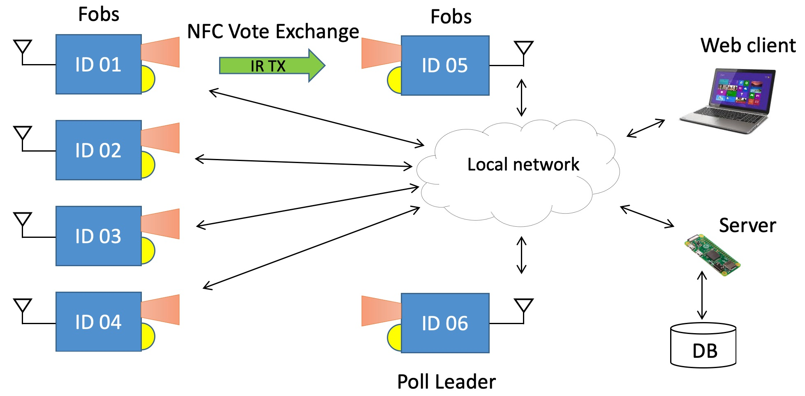

# E-Voting v2
Authors: Allen Zou, John Kircher, Alex Prior

Date: 2020-10-12
-----

## Summary
The purpose of this quest was to create a secure election process using both NFC and UDP communication between several voting FOBs and a central node.js server with a database for storing voter information and a web server for visualizing the data. One of the voting FOBs is selected to be the "poll leader" using a variation of the bully algorithm, with a new poll leader being elected in the case that the current poll leader fails. 

## Self-Assessment

### Objective Criteria

| Objective Criterion | Rating | Max Value  | 
|---------------------------------------------|:-----------:|:---------:|
| Objective One | 1 |  1     | 
| Objective Two | 1 |  1     | 
| Objective Three | 1 |  1     | 
| Objective Four | 1 |  1     | 
| Objective Five | 1 |  1     | 
| Objective Six | 1 |  1     | 
| Objective Seven | 1 |  1     | 

### Qualitative Criteria

| Qualitative Criterion | Rating | Max Value  | 
|---------------------------------------------|:-----------:|:---------:|
| Quality of solution | 5 |  5     | 
| Quality of report.md including use of graphics | 3 |  3     | 
| Quality of code reporting | 3 |  3     | 
| Quality of video presentation | 3 |  3     | 

## Solution Design

### Voting FOBs
We chose to implement the voting fobs as "people" rather than "stations", so each fob is allowed to vote once in the election. Each fob has 3 LEDs. The green LED indicates whether or not the fob is the poll leader, and the red and blue LEDs indicate which "party" the fob is voting for. The fobs can toggle which party they are voting for by pressing one of the two buttons, and the corresponding red or blue LED will light up accordingly. The second button will allow the fobs to transmit their voting data to an adjacent fob over NFC/IR.

In order to pick a poll leader, we use our code from Skill 28 (Leader election using a modified bully algorithm). This leader election happens passively in the background, and will always ensure that a poll leader is selected based on lowest available fob ID. If a poll leader fails (is disconnected), the modified bully algorithm will automatically select a new leader, and the main election process can pick up right where it left off. For documentation purposes, we will refer to non-leader fobs as "Followers".

Any one fob is able to transmit its voter data to any other adjacent fob using NFC/IR, including directly to the poll leader itself. If a follower fob chooses to transmit its vote to another follower fob, the receiving fob will briefly flash the LED corresponding with the transmitting fob's vote, then send the transmitting fob's voter information to the poll leader over UDP. The poll leader will then forward the original fob's voter information to the node.js server over UDP.

If a follower fob instead chooses to transmit its vote directly to the poll leader over NFC/IR, the poll leader will then immediately forward the data to the node.js server over UDP.

Lastly, the poll leader itself is able to vote by directly sending its data to the node.js server over UDP.

More information about how this was implemented in the code can be found in the code README inside the code folder.

### Node.js Server and Database
We chose to use levelDB as our database as we found the implementation with a node program was the easiest. LevelDB allowed us to easily create a new directory which we call 'mydb' to store a fob's time, id, and vote. For the node program we decided to use sockets.io for event based communication to the web client. 

The first step in the node program was to receive the message from the c program and neatly organize the fob's id and vote. We do this by creating 9 unqiue fob objects which store unique id's, votes, and time. After this data is stored we populate the levelDB database with the current vote received and then we stop that fob from communicating with a conditional as we would not want one person to vote twice. Finally, the node program then gets the information right back from the database and pushes it to the web client for real-time display. This process is replicated for an 'up to 9 fob implementation.' 

Additionally, each time there is a new election, the previous election data from every fob is cleared. We do this because we don't want to be counting old votes when we get information from the database. (i.e, you wanted one one vote to count as two or three).

The front-end web client set-up is very simple. We decided to store all fob information into tables diplaying time, id, and vote. Everytime data is sent to the front-end we check which fob sent it and populate that table with the data. Futhermore, we increment a blueVotes and redVote counter based on the vote from that fob. This allowed us to implement a button 'countVotes' that will display each party's votes. 

Any additional information about communication via sockets between node and the front end can be found in the code folder README. 

## Sketches and Photos

  

  

 

## Supporting Artifacts
- [Link to video demo](). Not to exceed 120s

## Modules, Tools, Source Used Including Attribution
RTOS, UART, sockets.h, GPIO, timer.h

Attribution to Brian Macomber for showing us how to handle two buttons using RTOS tasks

IR Communication: http://whizzer.bu.edu/briefs/design-patterns/dp-irtxrx

Leader Election Wiki: https://en.wikipedia.org/wiki/Leader_election

BUlly Algorithm: https://en.wikipedia.org/wiki/Bully_algorithm
## References

-----

