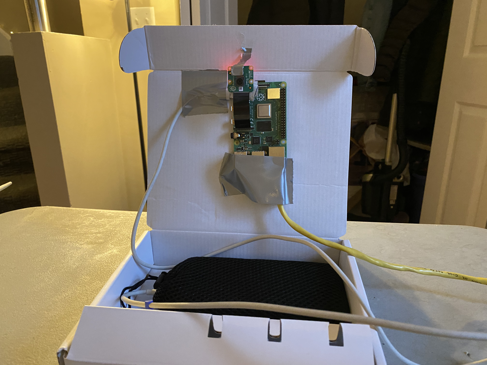
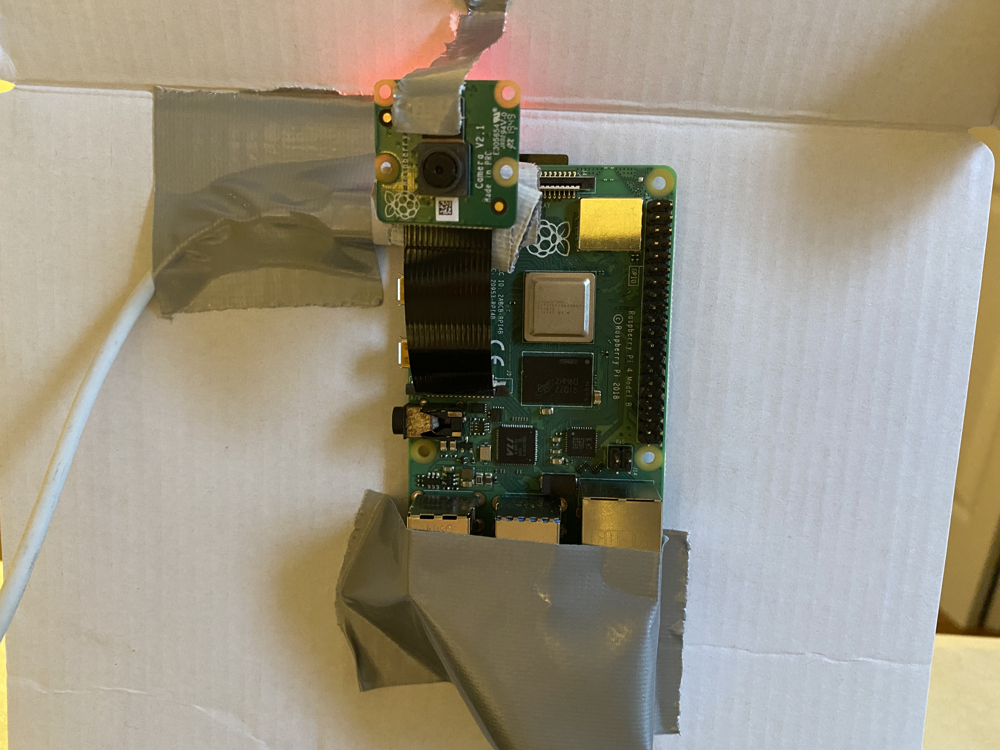
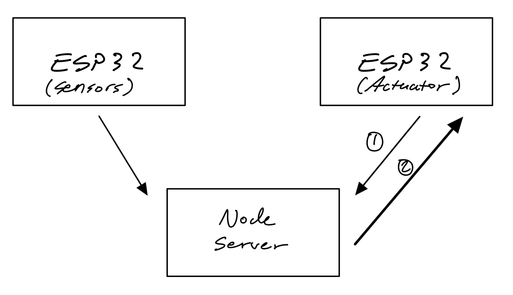
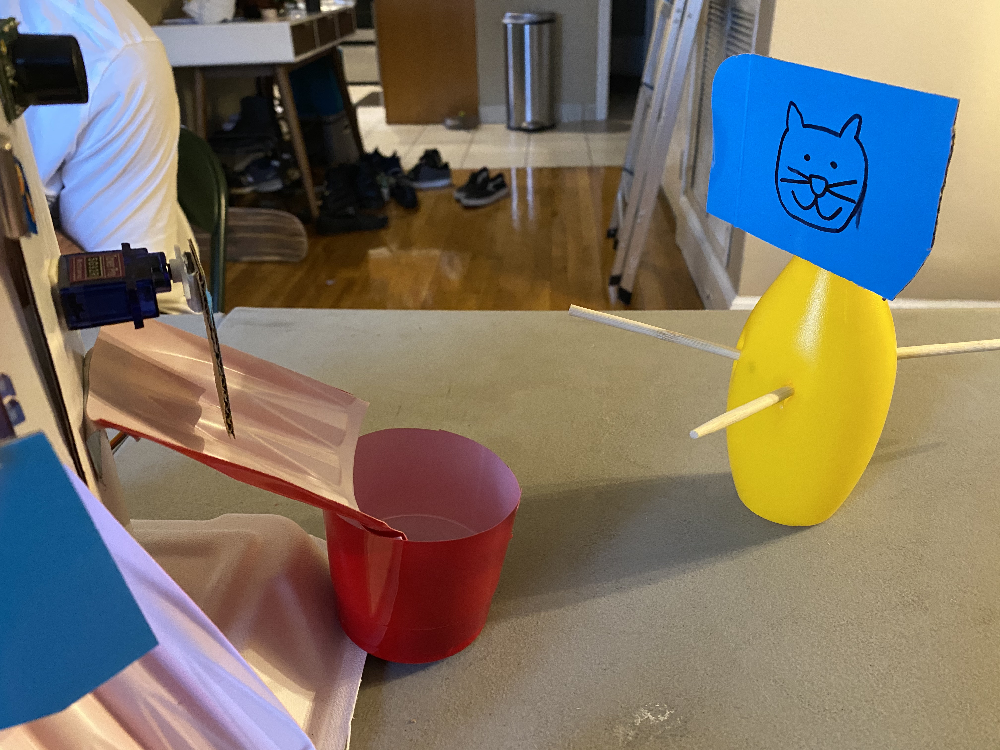
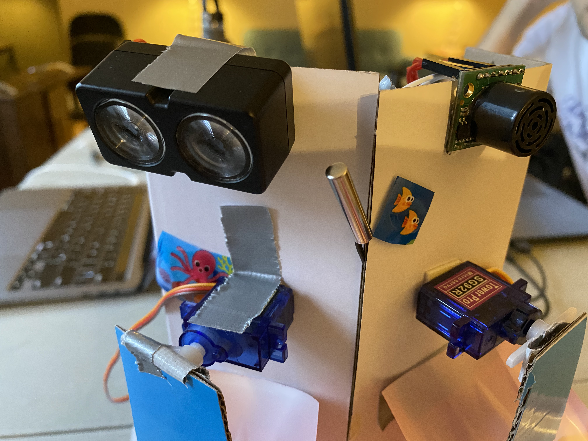
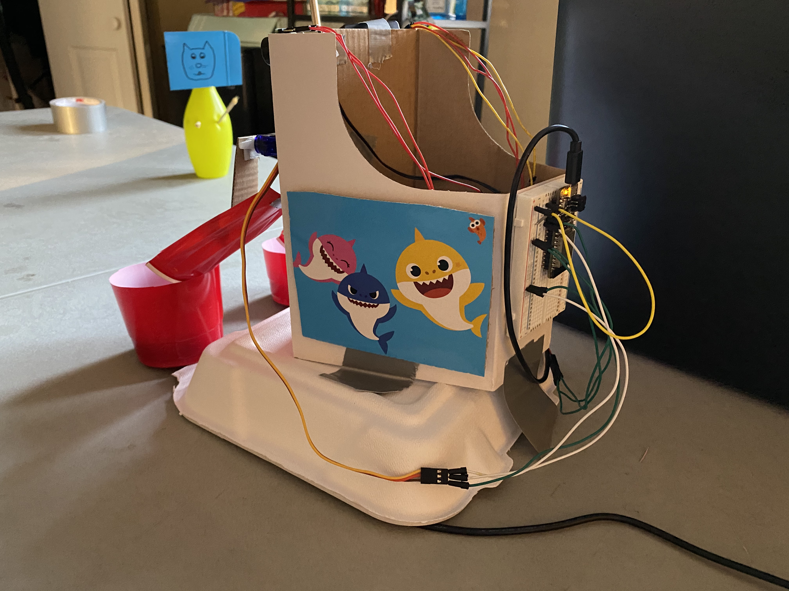
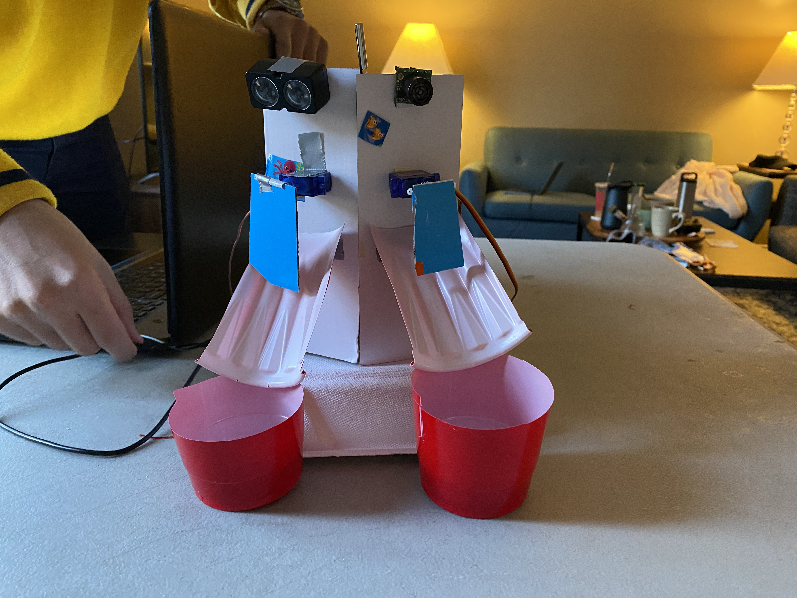
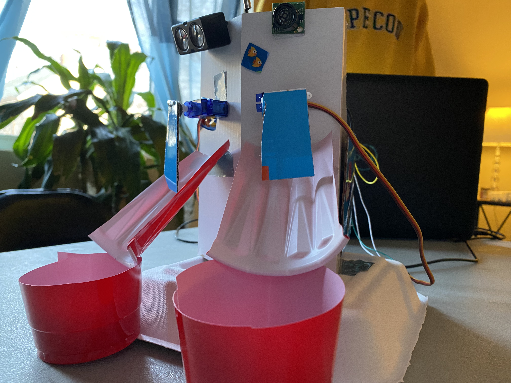

# Remote Pet Feeder
Authors: Alex Prior, Allen Zou, John Kircher

Date: 2020-12-14
-----

## Summary
The purpose of this quest was to implement a remote pet feeder that utilized servo control, ESP32 UDP communications,a camera, and timer based sensor tasks. The final product of this quest was able to read lidar, ultrasonic, and thermistor data every 3 second timer cycle. If a pet entered within a threshold for the lidar or ultrasonic sensors, we would alert the user and dispense food. The users also have a birds eye view of the feeder and remote access for feeding the animals on command. The system additionally uses separate ESPs for sensors and actuators to increase redundancy and increase system security. Both ESPs communicate with a node server hosted on the raspberry pi and communicate using messages sent through UDP packets.

## Self-Assessment

### Objective Criteria

| Objective Criterion | Rating | Max Value  | 
|---------------------------------------------|:-----------:|:---------:|
| Achieves specified function | 1 |  1     | 
| At least 2 functional actuators | 1 |  1     | 
| At least 3 functional sensors | 1 |  1     | 
| At least 1 camera | 1 |  1     | 
| Demonstrates remote control and data presentation on separate network | 1 |  1     | 
| Has a time based function | 1 |  1     | 
| Multiple participating distributed ESP32s | 1 |  1     | 

### Qualitative Criteria

| Qualitative Criterion | Rating | Max Value  | 
|---------------------------------------------|:-----------:|:---------:|
| Quality of solution | 5 |  5     | 
| Quality of report.md including use of graphics | 3 |  3     | 
| Quality of code reporting | 3 |  3     | 
| Quality of video presentation | 3 |  3     | 

## Solution Design
### Timer Based Sensor Tasks
For our pet feeder, we implemented the ultrasonic and lidar sensors to detect pet proximity to the device and a thermistor to monitor room/food temperature. The sensors read data based on a timer task. The timer isr handler flips the evt.flag to 1 every second which causes the timer task to modify a timerCounter variable by incrementing it by 1 and modulo-ing it by 3. This generates key values of 0, 1, and 2 in a 3 second timer cycle. We then use this variable to give each sensor an indiviual time slot to read data and prevents overlapping of sensor readings. The data is then converted into a UDP payload compatible char array. They are then appended and sent to the node server hosted on the raspberry pi (more information found in the Remote Control and UDP Communication section)

### Actuators
The actuators for this project came in the form of two servos. The servos are controlled on a separate breadboard and ESP32 from the sensors. This ESP consistenly sends a "dummy" UDP message to the node server and awaits a response. If the response from the server is equal to "Cat!" or "Dog!", a respective catFlag or dogFlag variable is tripped. These two variables are then constantly checked by the catServo and dogServo tasks. If the flag for each animal is set to 1, the servo task will execute and rotate 90 degrees and back. Alternatively, if the node server replies with a message "Nk!", the servo tasks do not execute and continue checking the flags.

### Remote Control and UDP Communication
To enable communication between the two ESP systems and enable remote control, we create a node server that operates as the middle man. In order to differentiate which ESP we are talking to, at the beginning of each UDP message that is sent to the server, we concatenate a "0" for the sensor ESP and a "1" for the actuator ESP. Using these identifiers, we can parse the sensor payload and update the respective data variables. To detect if an animal is near the feeder, we increment a counter variable that shows how long it has been within the distance threshold that we determined for the food bowl. If the counter hits a value of 5 for lidar or ultrasonic distance, we trip a dogMotion or catMotion flag, respectively. Since the sensor system doesn't require an action after it communicates with the server, we reply with a "Nk!" statement to close the UDP connection. However, the dogMotion and catMotion flags are then used to determine the the action of the servo system.

### DDNS
We leveraged DDNS and port forwarding to allow the user to access the pet feeder front end from anywhere in the world over the internet. By pointing the domain "Team5EC444.ddns.net" to our router's external IP address, and port forwarding the Raspberry Pi's web server, we were able to remotely execute the pet feeder's actuators at the press of a button.

### Camera
Having a live view of our system was essential to our quest. Any user on the site would be able to see their pets in real time and make sure that it is indeed their pet in front of the sensor and that the alert was not a potential glitch or another object. To use the camera we utilized the motion software to pull up a live stream on the pi's address and port 8081, http://team5ec444.ddns.net:8081. This web address is then used in our front end and set to scale for the website. 

## Sketches and Photos
### Raspberry Pi with Webcam

### Close-up of Raspberry Pi with Webcam

### Diagram of UDP Communication:

### Our cat waiting for some food:

### Close-up of LIDAR, Ultrasonic, Thermistor, and Actuators:

### Rear/Side View of the Pet Feeder:

### Front View of the Pet Feeder:

### Close-up View of the Pet Feeder:

## Supporting Artifacts
- [Link to video demo](). Not to exceed 120s

## Modules, Tools, Source Used Including Attribution
DDNS, Pi-Webcam, ADC, Ultrasonic sensor, LIDAR sensor, thermistor, actuators, ESP timer

## References
DDNS: https://en.wikipedia.org/wiki/Dynamic_DNS

Pi-Webcam: https://www.raspberrypi.org/products/camera-module-v2/?resellerType=home

ADC Example Code: https://github.com/espressif/esp-idf/tree/39f090a4f1dee4e325f8109d880bf3627034d839/examples/peripherals/adc

Ultrasonic Data Sheet: https://www.maxbotix.com/documents/HRLV-MaxSonar-EZ_Datasheet.pdf

Lidar Data Sheet: http://static.garmin.com/pumac/LIDAR-Lite%20LED%20v4%20Instructions_EN-US.pdf

Timer Design Pattern Brief: http://whizzer.bu.edu/briefs/design-patterns/dp-timer

